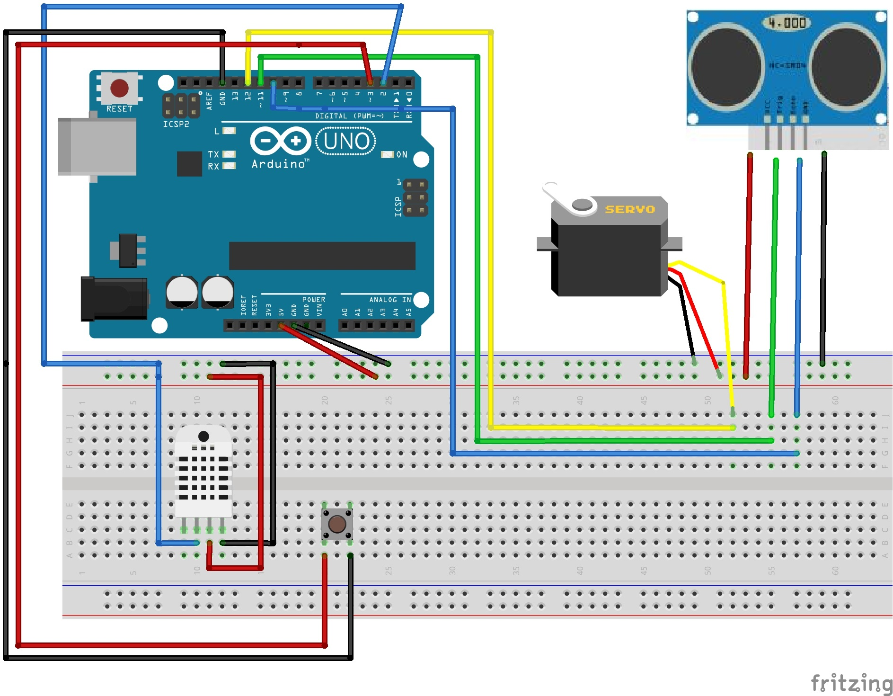
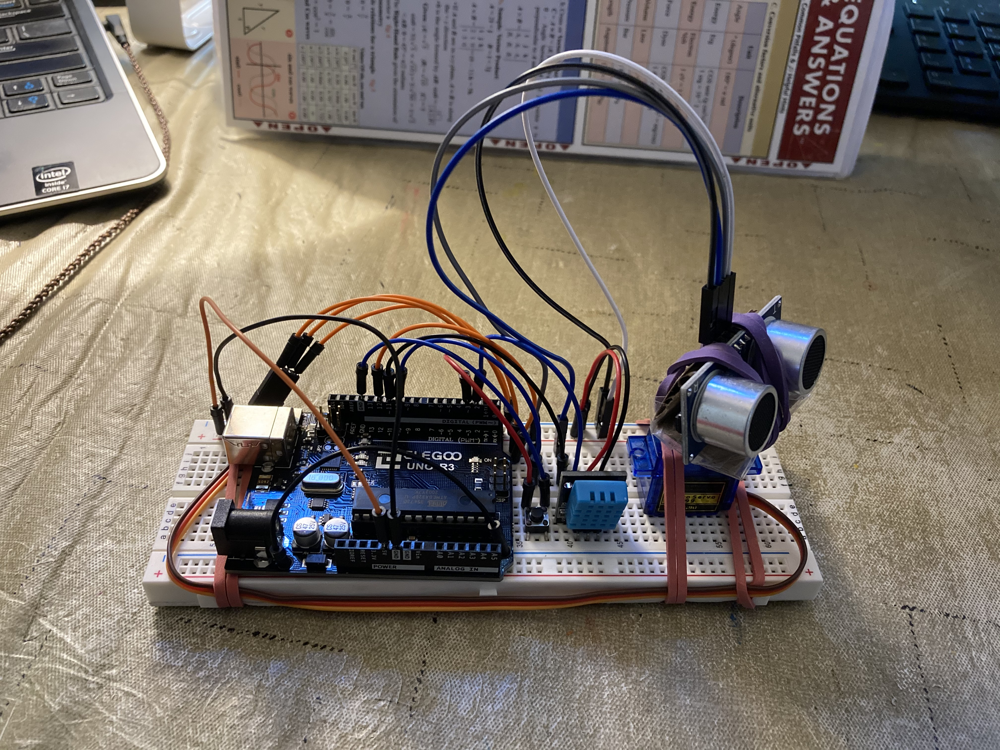
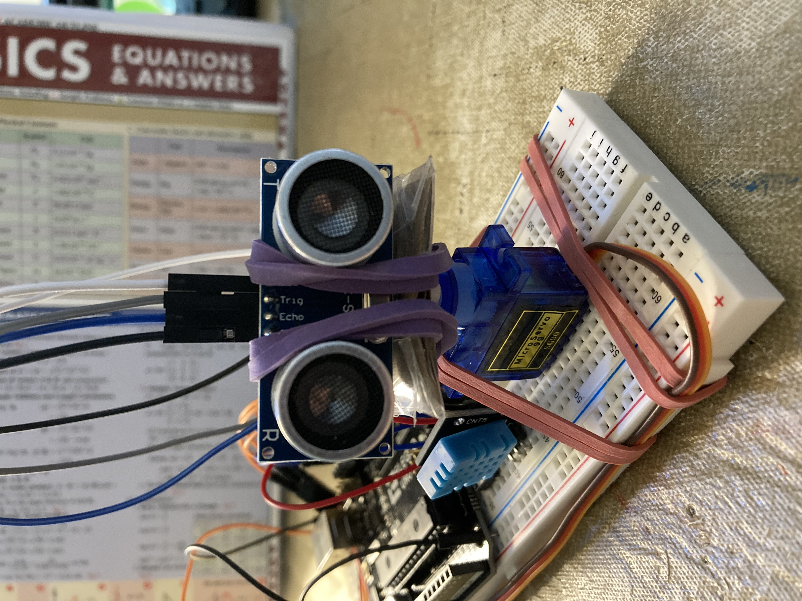

# COVID Room Traffic Monitor

An ultrasonic sound-based movement detection system that can be deployed in areas with small spaces to study foot traffic and congestion over periods of time.

## Installation

### Components
- Arduino UNO 
- DHT11 digital temperature and humidity sensor
- Breadboard Button
- Jumper cables
- Servo Motor
- HC-SR04 Ultrasonic Sensor

### Schematic

Figure 1: Schematic


Figure 2: Front View of Circuit


Figure 3: Ultrasonic Sensor Attached to Servo

To build the circuit, follow [this guide](http://howtomechatronics.com/projects/arduino-radar-project/) that the project was based on.

## Usage

Load the Arduino code into an Arduino UNO. Immediately after the code is loaded, run the Python script.
```python
python Industrial_COVID_Regulator.py
```

If you run into any issues, your best bet is to re-upload the code to the Arduino and run the Python script again. Currently, the code outputs all the degrees of its range scanned for the calibration stage. What then follows is any change detected by the sensor in the format:

`degree:measurement:calibration`

## Program Structure
1) Ultrasonic sensor rotates on servo and scans area, measuring the distance to every object around one degree at a time. This first iteration stores the distances as a calibration. Each measurement of distance, temperature, humidity, for each degree is sent to the Python script running on a computer via serial.
2) Every subsequent iteration of the sensor's sweep compares each degree's distance measurement to the object in front of it to the calibration distance at the corresponding degree. A change in this distance means something moved in its surroundings.
3) Store the timestamp of each instance of a change in distance in a DataFrame. This data is then visualized across various time intervals to reveal information about the movement of the environment.
